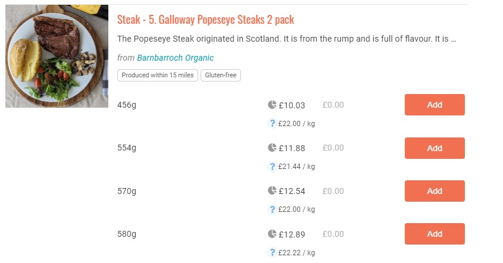

# Pricing Meat & other 'complete' products of unknown weight

Here we refer to products as _**'irregular'**_  if they are sold according to weight/volume but the exact quantity is not known until time of harvest/distribution.  

For example joints of meat, slices of cheese, large vegetables.

There are a number of different tools available on the OFN platform to help manage and organise these sales. 

## Option One: Set an average weight / price and reimburse

You can charge the average price of the product, and then reimburse or charge the customer extra, if the actual weight deviates from the mean. 

When you know the true weight of the products \(ie. when you are preparing orders for collection by customers\), log into "Bulk Order Management" \(Orders -&gt; Bulk Order Management\) and add the Weight / Volume column to the table.

You can then change the weight shown for each buyer for a given order and a given product. The price will be recalculated automatically according to the quantity entered.


Don't forget to resend an order confirmation email to the customer to notify them of the price difference and any monies they may subsequently owe.


## Option Two: Display price ranges 

Same logic as Option One, but simply instead of displaying an average price initially, indicate a price range. This solution has the advantage of clearly indicating to the buyer that the final price is likely to be modified. 

[Variants](product-variants.md) can also be utilised to create different ranges. 

> **Example 1** \(single product and one variant\):   
> Product = Chicken \(between 8 and 12 kg with price according to weight, £10 / kg\) 
>
> **Example 2** \(two variants for one product\):   
> Product = Chicken \(£10 / kg\)  
> Variant 1 = Small chicken \(between 8 and 12 kg, price according to actual weight\)  
> Variant 2 = Large chicken \(between 13 and 20 kg, price according to actual weight\) ...

## Option Three: Create variants with fixed prices 

A slightly simpler version of Option Two is to create variants for your products based on weight ranges but charge a **fixed price** for all items that fall within the range.   
For example if butternut squash costs £1/kg then you could list the variants with the following fixed prices:

* Small \(0.7 - 0.9 kg\)           £0.80
* Medium \(0.9 - 1.1 kg\)      £1.00
* Large \(1.1 - 1.3 kg\)           £1.20
* Extra Large \(1.3 - 1.5 kg\) £1.40

## Option Four: Create variants with known weights

If you know the weight of all your steaks, for example, in advance you can use the variant functionality to directly display the precise price for each item. Example:

## Editing Orders 

It may be difficult for meat producers to know in advance about product availability or prepare their packaging accordingly. \(Until slaughter the weight of a chicken or a leg of lamb maybe unknown.\)

This is not a problem since orders can be modified \(by adding, modifying or deleting products\) if necessary. For more information, see [Orders](../orders/). 

## Reimbursing or Charging customers the difference: How does it work? 

If a customer _**pays for their goods on their collection**_ or delivery, then the hub manager will have been able to modify the order before payment according to the actual weight and the products actually delivered. Hence in this instance there will be no need to reimburse or re-bill customer.

If an order is _**paid online before delivery**_, then you must refund or invoice for the the difference between monies already received and that owing for the precise products to be delivered. Click here to see [how](../orders/refunds-and-adjusting-payments.md). 


An alternative is to use an online payment system to temporarily store the amount "pending" until the order has been validated. 

_This feature is not yet implemented in Open Food Network. We are also working on the automated implementation of "credits" allowing a hub to reimburse in the form of a credit note which could be used by the customer as part payment for their next order._ 


## Inform the buyer about your pricing policy 

You can notify your customers about your pricing policies for variable weight items \(such as meat\) in the [message box](../enterprise-profile/enterprise-settings.md#shop-preferences) displayed at the top of your shop front. This is found in the Enterprise Settings -&gt; Shop Preferences. 

It might be useful to also add a reminder of these pricing policies in the description box of [Payment Methods](../shopfront/payment-methods.md).  For example, you may wish to add : "Remember that the final price may vary by 10% depending on weight if you have purchased non-divisible items such as meat or large vegetables.".

